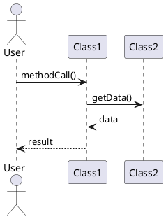

# Sequence Diagram Template

## Scenario: [Scenario Name]

**Source Spec:** specs/feature.md (lines X-Y)
**Related CRC Cards:** crc-ClassName1.md, crc-ClassName2.md

### Participants

- **Actor** - Description
- **ClassName1** - src/path/Class1.ext - Role description
- **ClassName2** - src/path/Class2.ext - Role description

### Sequence: [Main Flow]

**Use PlantUML ASCII art output** (generated with sequence-diagrammer agent or plantuml skill)

```
[PlantUML ASCII art goes here]
```

**PlantUML Source:**


### Analysis

#### Key Interactions
- **User → Class1**: Description

#### Design Notes
- Important design decisions

#### Traceability
- Maps to requirements in specs/feature.md
